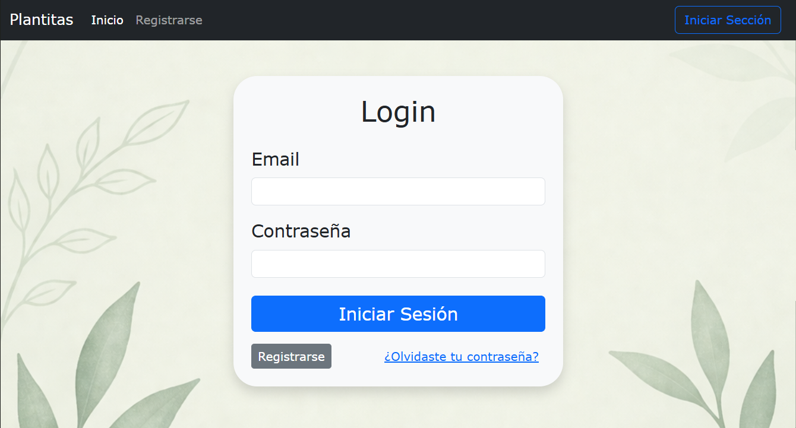
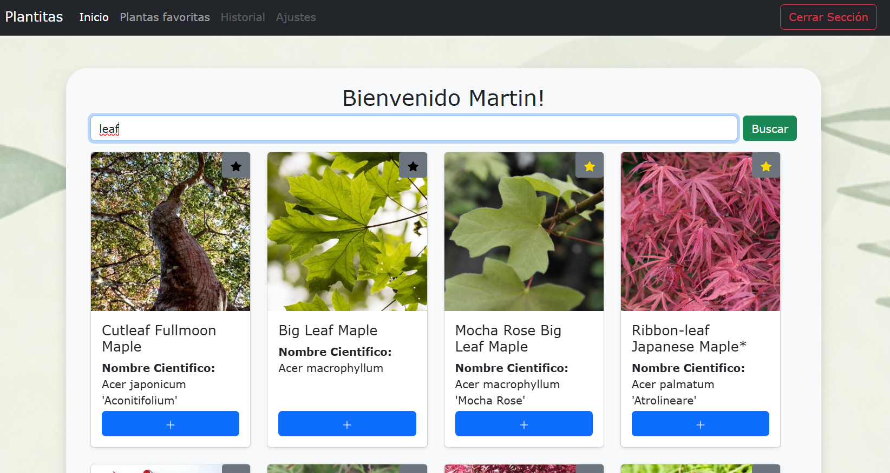
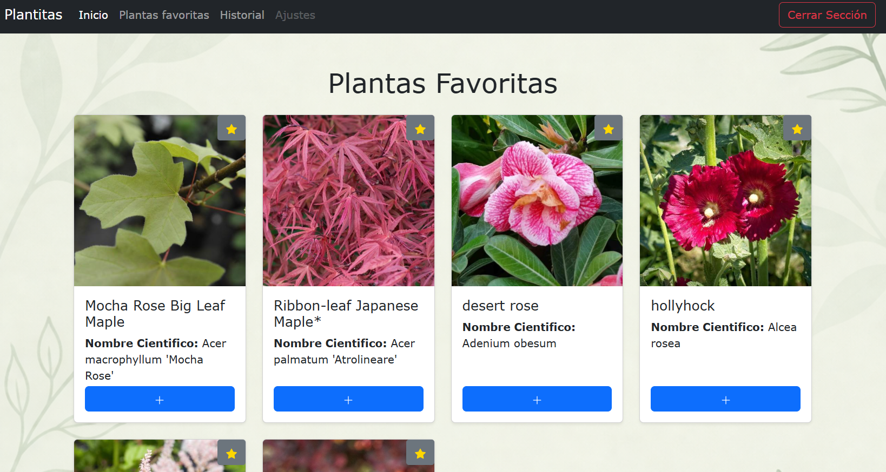

# 🌱 Proyecto Buscador de Plantas

Aplicación web full stack que permite explorar más de 3000 especies de plantas, guardar favoritas y gestionar información personalizada mediante autenticación segura.

Desarrollada con Django REST + React, implementando sincronización global de favoritos y consumo de API externa.

---

## 🚀 Tecnologías utilizadas

### Backend

* Python
* Django
* Django REST Framework
* JWT Authentication

### Frontend

* React (Vite)
* JavaScript
* Bootstrap

### Otros

* API externa de plantas
* Git & GitHub

---

## 🔐 Funcionalidades

* Registro e inicio de sesión de usuarios
* Autenticación mediante JWT
* Búsqueda de plantas a través de API externa
* Visualización de información de plantas
* Guardado de plantas favoritas
* Historial de búsquedas (en desarrollo)

---

## 🧠 Descripción técnica

La aplicación está construida con una arquitectura cliente-servidor:

* El backend en Django expone una API REST segura mediante JWT.
* El frontend en React consume esta API para mostrar la información al usuario.
* Se integra una API externa para obtener datos de más de 3000 especies de plantas.
* Se implementa persistencia de datos para usuarios, favoritos e historial.

---

## 📸 Screenshots

### 🔐 Autenticación de usuarios


### 🔍 Búsqueda de plantas en tiempo real


### ⭐ Gestión de Favoritos

---

## 🌐 Demo

*(Agregar link cuando deployes el proyecto)*

---

## ⚙️ Instalación y uso

### 1. Clonar repositorio

```bash
git clone https://github.com/JulianAstibia/P-API-Plantas.git
cd P-API-Plantas
```

---

### 2. Backend (Django)

```bash
cd backend
python -m venv venv
source venv/bin/activate  # En Windows: venv\Scripts\activate
pip install -r requirements.txt
python manage.py migrate
python manage.py runserver
```

---

### 3. Frontend (React)

```bash
cd frontend
npm install
npm run dev
```

---

## 🔑 Variables de entorno

Crear un archivo `.env` en el backend con:

```
SECRET_KEY=tu_clave
DEBUG=True

---

## 📌 Estado del proyecto

🚧 En desarrollo

Actualmente se están implementando mejoras en experiencia de usuario y nuevas funcionalidades.

### Próximas mejoras

* Historial de búsquedas funcional
* Mejoras en UI/UX
* Deploy en producción

---

## 🎯 Objetivo del proyecto

Este proyecto fue desarrollado como parte de mi aprendizaje en desarrollo full stack, con el objetivo de aplicar buenas prácticas en:

* Diseño de APIs REST
* Manejo de estado en frontend
* Autenticación segura con JWT
* Integración con APIs externas

---

## 📄 Licencia

Proyecto de uso educativo y como portfolio personal.